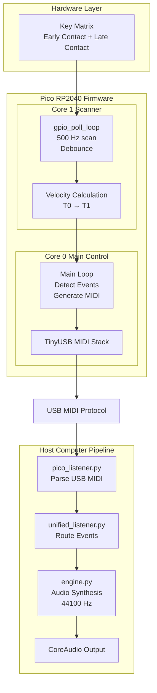

# MIDI Keyboard

Open-source velocity-sensitive USB MIDI keyboard controller built on the Raspberry Pi Pico (RP2040) with real-time polyphonic synthesis.

## Quick Start

### macOS / Linux
```bash
./setup.sh
```

### Windows
```powershell
.\setup.ps1
```

The setup script automatically installs dependencies and configures auto-launch. See [INSTALL.md](INSTALL.md) for detailed instructions.

## Features

- **Velocity-Sensitive Keys**: 2×25 matrix with early/late contact detection for accurate velocity measurement
- **Real-Time Synthesis**: Pure Python synthesizer with polyphonic playback
- **macOS Integration**: Menu bar app with live MIDI note display
- **Plug-and-Play**: USB MIDI device, no drivers required
- **Hardware-Agnostic Testing**: Comprehensive test suite that runs without hardware

## Architecture

### Hardware
- **Microcontroller**: Raspberry Pi Pico (RP2040)
- **Matrix**: 2×25 velocity-sensitive keyboard (25 keys total)
- **Interface**: MSQT32 shift registers for column reading
- **Communication**: USB MIDI over USB

### Software
- **Firmware**: C (Pico SDK, TinyUSB)
- **Synthesizer**: Python (sounddevice, numpy)
- **GUI**: Python (rumps for macOS menu bar)

## Project Structure

```
.
├── qwerty_midi_pico/          # Pico firmware
│   ├── drivers/               # Hardware drivers
│   │   ├── current/           # Active drivers
│   │   └── legacy/            # Legacy drivers
│   ├── tests/                 # Test suite
│   └── FLASH.md               # Firmware flashing guide
│
├── midi_sound_engine/          # Python synthesizer
│   ├── engine.py               # Core synthesis engine
│   ├── synth_menu.py           # macOS menu bar GUI
│   └── monitor_and_launch.py   # Auto-launch script
│
└── docs/                       # Documentation
    ├── architecture/           # System design
    ├── hardware/               # Hardware docs
    ├── implementation/         # Implementation guides
    └── testing/                # Testing docs
```

## Installation

See [INSTALL.md](INSTALL.md) for detailed installation instructions.

### Prerequisites

- Python 3.9+
- Raspberry Pi Pico (RP2040)
- CMake 3.13+ (for firmware development)

### Building Firmware

```bash
cd qwerty_midi_pico
mkdir build && cd build
cmake ..
make
```

Flash the `.uf2` file to your Pico by holding BOOTSEL and connecting via USB. See [qwerty_midi_pico/FLASH.md](qwerty_midi_pico/FLASH.md) for details.

## How It Works

### Velocity Detection

The keyboard uses a 2-phase scanning method:

1. **Early Contact (ROW0)**: Detects first touch → records timestamp T₀
2. **Late Contact (ROW1)**: Detects full press → records timestamp T₁
3. **Velocity Calculation**: `velocity = f(T₁ - T₀)` → MIDI velocity (1-127)

Faster key presses result in higher velocity values.

## System Architecture


### Data Flow Summary

**Hardware → Firmware:**
1. Multiple keys pressed simultaneously
2. 2×25 matrix scanned at 500Hz (Core 1)
3. Early/late contact detection per key
4. Velocity calculated from time delta

**Firmware Processing (Dual-Core):**
- **Core 1**: Continuous GPIO polling, velocity calculation, debouncing
- **Core 0**: USB MIDI stack, event detection, message generation
- **IPC**: Shared memory for key states between cores

**USB MIDI Transmission:**
- Polyphonic Note ON/OFF messages
- Velocity data included (1-127)
- Asynchronous, non-blocking transmission

**Host System:**
- MIDI listener receives USB messages
- Audio engine processes polyphonically
- Core Audio outputs to speakers

## Testing

The project includes a comprehensive test suite that validates the velocity calculation algorithm without requiring hardware:

```bash
cd qwerty_midi_pico/tests
make test_velocity_simple
./test_velocity_simple
```

## Configuration

### Pin Assignments

Update these in `qwerty_midi_pico/drivers/current/velocity_matrix.h`:
```c
#define ROW0_PIN 6   // Early contact row
#define ROW1_PIN 7   // Late contact row
```

Update in `qwerty_midi_pico/drivers/current/msqt32_shift_register.h`:
```c
#define SHIFT_DATA_PIN  10  // MSQT32 data
#define SHIFT_CLOCK_PIN 11  // MSQT32 clock
#define SHIFT_LATCH_PIN 12  // MSQT32 latch
```

### MIDI Note Mapping

Edit `qwerty_midi_pico/main.c` to change key-to-note mappings:
```c
const uint8_t midi_notes[NUM_KEYS] = {
    60, 61, 62, ...  // C4, C#4, D4, ...
};
```

## Documentation

Complete documentation is available in the [docs/](docs/) directory:
- [INSTALL.md](INSTALL.md) - Detailed installation guide
- [docs/](docs/) - Complete documentation index
- [qwerty_midi_pico/FLASH.md](qwerty_midi_pico/FLASH.md) - Firmware flashing

## Contributing

Contributions are welcome! Please see [docs/root_docs/CONTRIBUTING.md](docs/root_docs/CONTRIBUTING.md) for guidelines.

## License

This project is licensed under the MIT License - see the [LICENSE](LICENSE) file for details.

## Authors

- **Michael Danylchuk** - Firmware, Audio Engine, macOS GUI
- **Christopher "Zac" Hatchett** - Hardware Design, PCB, GPIO Integration

## Acknowledgments

- San Jose State University (EE198A Senior Design Project)
- Dr. Nadir Mir - Project Mentor
- Raspberry Pi Foundation - Pico SDK
- TinyUSB Contributors - USB stack
