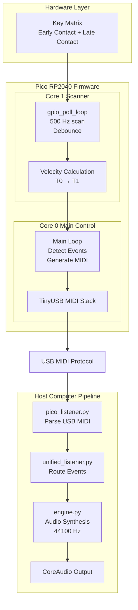
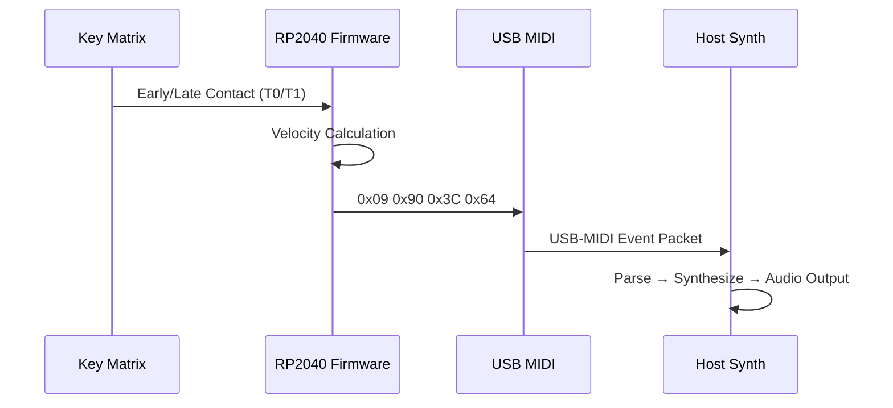

# MIDI Keyboard

Open-source velocity-sensitive USB MIDI keyboard controller built on the Raspberry Pi Pico (RP2040) with real-time polyphonic synthesis.
## Hardware Gallery

### PCB Layout  


### Electrical Schematic  


## Quick Start

### macOS / Linux
```bash
./setup.sh
```

### Windows
```powershell
.\setup.ps1
```

The setup script automatically installs dependencies and configures auto-launch. See [INSTALL.md](INSTALL.md) for detailed instructions.

## Features

- **Velocity-Sensitive Keys**: 2×25 matrix with early/late contact detection for accurate velocity measurement
- **Real-Time Synthesis**: Pure Python synthesizer with polyphonic playback
- **macOS Integration**: Menu bar app with live MIDI note display
- **Plug-and-Play**: USB MIDI device, no drivers required
- **Hardware-Agnostic Testing**: Comprehensive test suite that runs without hardware

## Architecture

### Hardware
- **Microcontroller**: Raspberry Pi Pico (RP2040)
- **Matrix**: 2×25 velocity-sensitive keyboard (25 keys total)
- **Interface**: MSQT32 shift registers for column reading
- **Communication**: USB MIDI over USB

### Software
- **Firmware**: C (Pico SDK, TinyUSB)
- **Synthesizer**: Python (sounddevice, numpy)
- **GUI**: Python (rumps for macOS menu bar)

## Project Structure

```
.
├── qwerty_midi_pico/          # Pico firmware
│   ├── drivers/               # Hardware drivers
│   │   ├── current/           # Active drivers
│   │   └── legacy/            # Legacy drivers
│   ├── tests/                 # Test suite
│   └── FLASH.md               # Firmware flashing guide
│
├── midi_sound_engine/          # Python synthesizer
│   ├── engine.py               # Core synthesis engine
│   ├── synth_menu.py           # macOS menu bar GUI
│   └── monitor_and_launch.py   # Auto-launch script
│
└── docs/                       # Documentation
    ├── architecture/           # System design
    ├── hardware/               # Hardware docs
    ├── implementation/         # Implementation guides
    └── testing/                # Testing docs
```

## Installation

See [INSTALL.md](INSTALL.md) for detailed installation instructions.

### Prerequisites

- Python 3.9+
- Raspberry Pi Pico (RP2040)
- CMake 3.13+ (for firmware development)

### Building Firmware

```bash
cd qwerty_midi_pico
mkdir build && cd build
cmake ..
make
```

Flash the `.uf2` file to your Pico by holding BOOTSEL and connecting via USB. See [qwerty_midi_pico/FLASH.md](qwerty_midi_pico/FLASH.md) for details.

## How It Works

### Velocity Detection

The keyboard uses a 2-phase scanning method:

1. **Early Contact (ROW0)**: Detects first touch → records timestamp T₀
2. **Late Contact (ROW1)**: Detects full press → records timestamp T₁
3. **Velocity Calculation**: `velocity = f(T₁ - T₀)` → MIDI velocity (1-127)

Faster key presses result in higher velocity values.

## System Architecture


### Data Flow Summary

**Hardware → Firmware:**
1. Multiple keys pressed simultaneously
2. 2×25 matrix scanned at 500Hz (Core 1)
3. Early/late contact detection per key
4. Velocity calculated from time delta

**Firmware Processing (Dual-Core):**
- **Core 1**: Continuous GPIO polling, velocity calculation, debouncing
- **Core 0**: USB MIDI stack, event detection, message generation
- **IPC**: Shared memory for key states between cores

**USB MIDI Transmission:**
- Polyphonic Note ON/OFF messages
- Velocity data included (1-127)
- Asynchronous, non-blocking transmission

**Host System:**
- MIDI listener receives USB messages
- Audio engine processes polyphonically
- Core Audio outputs to speakers

## MIDI Protocol

### What is MIDI?

MIDI (Musical Instrument Digital Interface) is a technical standard that describes a communications protocol, digital interface, and electrical connectors for connecting musical instruments, computers, and related audio devices. MIDI enables devices to communicate musical information in real-time.

### How This Project Uses MIDI

This project implements USB MIDI, which uses the MIDI protocol over USB connections. The firmware generates standard MIDI messages that are transmitted asynchronously to the host computer.

### MIDI Messages Used

**Note ON Messages:**
- Format: `0x90 | channel, note_number, velocity`
- Sent when a key is pressed
- Includes velocity data (1-127) for dynamic expression
- Example: Key pressed with velocity 100 → `[0x90, 60, 100]` (Note C4, velocity 100)

**Note OFF Messages:**
- Format: `0x80 | channel, note_number, 0`
- Sent when a key is released
- Ensures clean note termination
- Example: Key released → `[0x80, 60, 0]` (Note C4 off)

**Polyphonic Support:**
- Multiple Note ON messages can be sent simultaneously
- Each key generates independent MIDI messages
- Supports full polyphony (all 25 keys can play simultaneously)
- Messages are queued and transmitted asynchronously

### MIDI Advantages Over Other Protocols

**1. Universal Compatibility:**
- MIDI is the industry standard for musical instrument communication
- Works with virtually all music software (DAWs, synthesizers, sequencers)
- No proprietary drivers required - plug-and-play on all operating systems

**2. Low Latency:**
- MIDI messages are small (3 bytes for Note ON/OFF)
- Minimal processing overhead
- Real-time transmission suitable for live performance
- Asynchronous transmission doesn't block other operations

**3. Rich Musical Data:**
- Velocity sensitivity (1-127) provides expressive control
- Standard note numbering (0-127) maps directly to musical pitches
- Extensible protocol supports additional controllers and parameters

**4. Polyphonic Capability:**
- Each note is independent - true polyphonic expression
- Multiple simultaneous notes don't interfere with each other
- Standard protocol handles polyphony natively

**5. Software Integration:**
- Direct compatibility with audio software (Logic, Ableton, GarageBand, etc.)
- Can route to any MIDI-compatible synthesizer or sampler
- Enables recording, sequencing, and real-time processing

**6. Hardware Abstraction:**
- MIDI abstracts physical key presses into musical events
- Software can interpret MIDI data independently of hardware
- Enables remapping, transposition, and effects processing

### MIDI Implementation Details

**USB MIDI Class:**
- Uses USB MIDI Class specification (part of USB Audio Class)
- Standard USB device class - no custom drivers needed
- Works on macOS, Windows, and Linux without configuration

**Message Format:**
- 3-byte messages for Note ON/OFF
- First byte: Status (0x90 = Note ON, 0x80 = Note OFF)
- Second byte: Note number (0-127, MIDI note 60 = C4)
- Third byte: Velocity (1-127 for Note ON, 0 for Note OFF)

**Transmission:**
- Asynchronous USB transmission via TinyUSB stack
- Non-blocking operation - doesn't delay GPIO scanning
- Core 0 handles USB tasks independently of Core 1 GPIO polling

## Testing

The project includes a comprehensive test suite that validates the velocity calculation algorithm without requiring hardware:

```bash
cd qwerty_midi_pico/tests
make test_velocity_simple
./test_velocity_simple
```

## Configuration

### Pin Assignments

Update these in `qwerty_midi_pico/drivers/current/velocity_matrix.h`:
```c
#define ROW0_PIN 6   // Early contact row
#define ROW1_PIN 7   // Late contact row
```

Update in `qwerty_midi_pico/drivers/current/msqt32_shift_register.h`:
```c
#define SHIFT_DATA_PIN  10  // MSQT32 data
#define SHIFT_CLOCK_PIN 11  // MSQT32 clock
#define SHIFT_LATCH_PIN 12  // MSQT32 latch
```

### MIDI Note Mapping

Edit `qwerty_midi_pico/main.c` to change key-to-note mappings:
```c
const uint8_t midi_notes[NUM_KEYS] = {
    60, 61, 62, ...  // C4, C#4, D4, ...
};
```
## Event Flow Example (Note On)



## Documentation

Complete documentation is available in the [docs/](docs/) directory:
- [INSTALL.md](INSTALL.md) - Detailed installation guide
- [docs/](docs/) - Complete documentation index
- [qwerty_midi_pico/FLASH.md](qwerty_midi_pico/FLASH.md) - Firmware flashing

## Contributing

Contributions are welcome! Please see [docs/root_docs/CONTRIBUTING.md](docs/root_docs/CONTRIBUTING.md) for guidelines.

## License

This project is licensed under the MIT License - see the [LICENSE](LICENSE) file for details.

## Authors

- **Michael Danylchuk** - Firmware, Audio Engine, macOS GUI
- **Christopher "Zac" Hatchett** - Hardware Design, PCB, GPIO Integration

## Acknowledgments

- San Jose State University (EE198A Senior Design Project)
- Dr. Nadir Mir - Project Mentor
- Raspberry Pi Foundation - Pico SDK
- TinyUSB Contributors - USB stack
