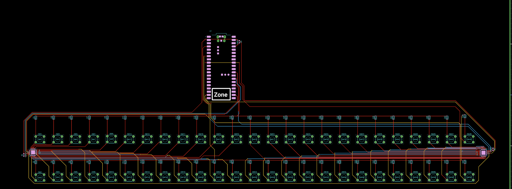
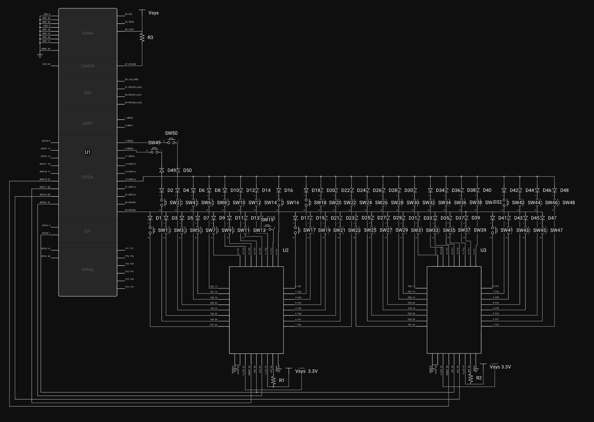

# MIDIKeyboard-SoundEngine

**Status:** Stable | Actively maintained | MIDI tested cross-platform; audio verified on macOS

Open-source, velocity-sensitive USB MIDI keyboard built on the RP2040 microcontroller, featuring true dual-contact key sensing and class-compliant USB MIDI.

A fully open, repairable 25-key MIDI controller with real-time USB MIDI output and a Python synthesizer built on a cross-platform PortAudio backend. Designed to be low-cost, expressive, and educational without sacrificing real-time performance.

**At a glance:**
- True dual-contact velocity sensing (no firmware tricks)
- Dual-core RP2040 real-time architecture
- Class-compliant USB MIDI (no drivers)
- Measured scan rates and latency characteristics
- Fully open hardware, firmware, and host software

---

## 1. Motivation

Most low-cost MIDI keyboards rely on simplified velocity approximations, proprietary firmware, and closed hardware designs that are difficult to repair or modify.

This project demonstrates that expressive, velocity-sensitive MIDI input can be achieved using fully open hardware and firmware on a commodity microcontroller, without vendor lock-in or custom drivers.

Key goals:
1. True velocity sensing using dual-contact timing
2. Class-compliant USB MIDI with zero driver setup
3. Fully open and repairable hardware design
4. Clear separation of hardware, firmware, and host software

---

## 2. System Components

### 2.1 Hardware
1. Custom 2×25 dual-contact key matrix (25 keys total)
2. Diode-isolated matrix for reliable scanning
3. Raspberry Pi Pico (RP2040)
4. Open schematic and PCB design

### 2.2 Firmware
1. Written in C using the Pico SDK and TinyUSB
2. Dual-core architecture:
   - Core 1: high-frequency matrix scanning and velocity timing
   - Core 0: MIDI event handling and USB communication
3. Class-compliant USB MIDI device

### 2.3 Host Software
1. Python-based polyphonic synthesizer
2. Real-time MIDI listener
3. Audio output via PortAudio (verified on macOS)
4. Optional macOS menu bar interface

---

## 3. Key Features

1. True velocity sensing via early/late contact timing
2. Low-latency dual-core RP2040 design
3. Polyphonic playback across all 25 keys
4. Plug-and-play USB MIDI operation
5. Fully open and repairable hardware
6. Testable firmware logic without physical hardware

---

## 4. System Overview

1. Key press detected by dual-contact matrix (t₀, t₁)
2. Velocity calculated in firmware on the RP2040
3. USB MIDI note event transmitted
4. Host synthesizer renders polyphonic audio

Velocity is calculated from the time delta between early and late contact closures and mapped to the standard MIDI velocity range (1–127).

The architecture is intentionally modular, allowing the key matrix, firmware logic, or host synthesizer to be extended or replaced independently.

See [docs/architecture/SYSTEM_DESIGN.md](docs/architecture/SYSTEM_DESIGN.md) for detailed architecture documentation.

---

## 5. Quick Start

### 5.1 macOS / Linux

```bash
chmod +x setup.sh
./setup.sh
```

### 5.2 Windows

```powershell
.\setup.ps1
```

The setup scripts install Python dependencies, configure the synthesizer environment, detect the Pico automatically, and launch the audio engine.

See [INSTALL.md](INSTALL.md) for manual setup instructions.

---

## 6. Performance Characteristics

The following characteristics were measured or observed during development and functional testing.

Observed during functional testing:

- **Matrix scan rate**: Approximately 500–540 Hz on Core 1
- **Velocity timing resolution**: On the order of tens of microseconds
- **USB MIDI latency**: Full-speed USB with 1 ms polling interval
- **Polyphony**: Sustained playback of all 25 keys without audio dropouts
- **Host audio sample rate**: 44.1 kHz
- **Core utilization**: Core 1 dedicated to scanning and timing; Core 0 handles USB stack and event processing
- **Platform validation**: Audio output verified on macOS; Windows and Linux rely on default PortAudio device selection

These characteristics were validated under sustained polyphonic load during normal interactive use.

---

## 7. Hardware Gallery

<div align="center">

### PCB Layout



*Complete PCB design showing 2×25 keyboard matrix, MSQT32 shift registers, and Raspberry Pi Pico integration*

### Electrical Schematic



*Full circuit schematic including velocity detection matrix, shift register interface, and USB MIDI connections*

### Design Files

- **[Flux Project File](hardware/mikeld37-midi-keyboard.flx)** - Complete PCB design in Flux format

</div>

---

## 8. Architecture

High-level system architecture:


```mermaid
flowchart LR

    subgraph HW[Hardware Layer]
        K["25-Key Dual-Contact Matrix"]
        SR["Shift Registers (MSQT32)"]
        MCU["Raspberry Pi Pico RP2040"]
    end
    K -->|Row/Column Signals| SR
    SR -->|Multiplexed Key States| MCU

    subgraph FW[Firmware on RP2040]
        subgraph Core1["Core 1 - Scanner"]
            S1["Matrix Scan Loop"]
            D1[Debounce + Edge Detection]
            VEL["Velocity Calculation"]
        end
        subgraph Core0["Core 0 - USB Stack"]
            EV["MIDI Event Generation"]
            USB[TinyUSB Driver]
        end
    end
    MCU --> FW

    S1 --> D1 --> VEL --> EV --> USB

    subgraph USBMIDI[USB Transport]
        UTX["USB Full-Speed 12 Mbps"]
        URX[Host USB Stack]
    end
    USB --> UTX --> URX

    subgraph HOST[Host Computer]
        LST[MIDI Listener]
        SYNTH[Polyphonic Synthesizer]
        AC[Audio Output]
    end
    URX --> LST --> SYNTH --> AC

    style HW fill:#f8f8ff,stroke:#555,stroke-width:1px
    style FW fill:#eefaff,stroke:#555,stroke-width:1px
    style USBMIDI fill:#fffce8,stroke:#555,stroke-width:1px
    style HOST fill:#f3fff0,stroke:#555,stroke-width:1px
```

For detailed architecture diagrams including velocity sensing subsystem and dual-core processing flow, see [docs/architecture/SYSTEM_DESIGN.md](docs/architecture/SYSTEM_DESIGN.md).

---

## 9. Firmware Build

```bash
cd qwerty_midi_pico
mkdir build && cd build
cmake ..
make
```

To flash:
1. Hold the BOOTSEL button on the Pico
2. Connect via USB
3. Release BOOTSEL
4. Copy the generated `.uf2` file to the mounted device

See [qwerty_midi_pico/FLASH.md](qwerty_midi_pico/FLASH.md) for detailed flashing instructions.

---

## 10. Hardware Documentation

PCB layout and schematics are located in `hardware/`. Flux design files are included. The design emphasizes ease of repair and modification. The schematic and PCB layout were logically verified but not fabricated. All firmware and software systems were fully implemented and validated.

See [docs/hardware/](docs/hardware/) for detailed hardware documentation.

---

## 11. Testing

The project includes tests that validate velocity timing calculations, debouncing behavior, MIDI message generation, and matrix scanning logic. Most tests can be executed without physical hardware.

See [docs/testing/TESTING_GUIDE.md](docs/testing/TESTING_GUIDE.md) for detailed testing documentation.

---

## 12. Academic Context

This project originated as an Electrical Engineering senior design project at San José State University and has since been refined into a standalone open-source system.

[View Senior Design Poster PDF](docs/SeniorDesignPosterBoard.pdf)

---

## 13. License

This project is licensed under the MIT License.
See [LICENSE](LICENSE) for details.

---

## 14. Authors

1. **Michael Danylchuk** - Firmware, audio engine, system architecture
2. **Zac Hatchett** - Hardware design, PCB, electrical integration

---

## 15. Acknowledgments

1. Dr. Nadir Mir, Project Advisor
2. San José State University Electrical Engineering Department
3. Raspberry Pi Foundation
4. TinyUSB contributors

---

## 16. Project Status

Stable and functional. Actively maintained.

---

## Documentation

Complete documentation is available in the [`docs/`](docs/) directory:

### Getting Started
- [INSTALL.md](INSTALL.md) - Detailed installation guide
- [QUICKSTART.md](docs/root_docs/QUICKSTART.md) - 5-minute quick start

### Architecture & Design
- [System Design](docs/architecture/SYSTEM_DESIGN.md) - Complete system architecture
- [Hardware Documentation](docs/hardware/) - PCB, schematic, and hardware guides

### Development
- [Contributing Guidelines](docs/root_docs/CONTRIBUTING.md) - How to contribute
- [Project Structure](docs/root_docs/PROJECT_STRUCTURE.md) - Code organization
- [Firmware Flashing](qwerty_midi_pico/FLASH.md) - Pico firmware deployment

### Technical Details
- [Testing Guide](docs/testing/TESTING_GUIDE.md) - Test suite documentation
- [Hardware Documentation](docs/hardware/) - Velocity matrix, PCB, and schematic guides

---

## Contributing

Contributions are welcome! This project follows standard open-source practices:

1. **Fork the repository**
2. **Create a feature branch** (`git checkout -b feature/amazing-feature`)
3. **Commit your changes** (`git commit -m 'Add amazing feature'`)
4. **Push to the branch** (`git push origin feature/amazing-feature`)
5. **Open a Pull Request**

Please see [docs/root_docs/CONTRIBUTING.md](docs/root_docs/CONTRIBUTING.md) for detailed contribution guidelines, code style, and development workflow.
