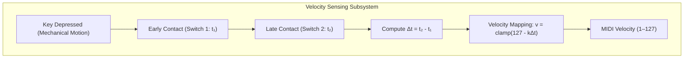

# MIDIKeyboard-SoundEngine

Open-source, velocity-sensitive USB MIDI keyboard built on the RP2040.

A fully open, repairable 25-key MIDI controller with true dual-contact velocity sensing, real-time USB MIDI output, and a cross-platform Python synthesizer. Designed to be low-cost, expressive, and educational without sacrificing real-time performance.

---

## 1. Motivation

Most low-cost MIDI keyboards rely on simplified velocity approximations, proprietary firmware, and closed hardware designs that are difficult to repair or modify.

This project was built to demonstrate that expressive, velocity-sensitive MIDI input can be achieved using fully open hardware and firmware on a commodity microcontroller, without vendor lock-in or custom drivers.

Key goals:
1. True velocity sensing using dual-contact timing
2. Class-compliant USB MIDI with zero driver setup
3. Fully open and repairable hardware design
4. Clear separation of hardware, firmware, and host software

---

## 2. System Components

### 2.1 Hardware
1. Custom 2×25 dual-contact key matrix (25 keys total)
2. Diode-isolated matrix for reliable scanning
3. Raspberry Pi Pico (RP2040)
4. Open schematic and PCB design

### 2.2 Firmware
1. Written in C using the Pico SDK and TinyUSB
2. Dual-core architecture:
   - Core 1: high-frequency matrix scanning and velocity timing
   - Core 0: MIDI event handling and USB communication
3. Class-compliant USB MIDI device

### 2.3 Host Software
1. Python-based polyphonic synthesizer
2. Real-time MIDI listener
3. Cross-platform audio output
4. Optional macOS menu bar interface

---

## 3. Key Features

1. True velocity sensing via early/late contact timing
2. Low-latency dual-core RP2040 design
3. Polyphonic playback across all 25 keys
4. Plug-and-play USB MIDI operation
5. Fully open and repairable hardware
6. Testable firmware logic without physical hardware

---

## 4. System Overview

End-to-end data flow:

Key Press
→ Dual-Contact Matrix (t0, t1)
→ RP2040 Firmware
- Core 1: scan + velocity timing
- Core 0: MIDI event generation
→ USB MIDI (class-compliant)
→ Host MIDI Listener
→ Python Synth Engine
→ Audio Output

Velocity is calculated from the time delta between early and late contact closures and mapped to the standard MIDI velocity range (1–127).

---

## 5. Hardware Gallery

<div align="center">

### PCB Layout


*Complete PCB design showing 2×25 keyboard matrix, MSQT32 shift registers, and Raspberry Pi Pico integration*

### Electrical Schematic


*Full circuit schematic including velocity detection matrix, shift register interface, and USB MIDI connections*

### Design Files

- **[Flux Project File](hardware/mikeld37-midi-keyboard.flx)** - Complete PCB design in Flux format

</div>

---

## 6. Schematics

### Complete System Architecture

This diagram illustrates the full system architecture from hardware to host software, showing all layers and data flow:


```mermaid
flowchart LR

    %% =========================
    %% HARDWARE LAYER
    %% =========================
    subgraph HW[Hardware Layer]
        K["25-Key Dual-Contact Matrix (Early/Late switches)"]
        SR["Shift Registers (MSQT32)"]
        MCU["Raspberry Pi Pico RP2040"]
    end
    K -->|Row/Column Signals| SR
    SR -->|Multiplexed Key States| MCU

    %% =========================
    %% FIRMWARE LAYER
    %% =========================
    subgraph FW[Firmware on RP2040]
        subgraph Core1["Core 1 - High-Frequency Scanner"]
            S1["Matrix Scan Loop 540 Hz"]
            D1[Debounce + Edge Detection]
            T1["Timestamp t₁ (Early Contact)"]
            T2["Timestamp t₂ (Late Contact)"]
            DT["Compute Δt = t₂ - t₁"]
            VEL["Velocity Mapping 1–127: v = clamp(127 - kΔt)"]
        end
        subgraph Core0["Core 0 - Event Handler + USB Stack"]
            EV["Construct MIDI Note Event (Note, Velocity)"]
            PKT["USB-MIDI Packet Encoder (4-byte Event Packet)"]
            USB[TinyUSB Driver]
        end
        LOGF["Firmware Log Output (SCAN_PERIOD, VEL_SAMPLE, NOTE_EVENT, NOTE_SEND)"]
    end
    MCU --> FW

    %% Firmware Data Flow
    S1 --> D1 --> T1
    D1 --> T2
    T1 --> DT
    T2 --> DT --> VEL --> EV --> PKT --> USB --> LOGF

    %% =========================
    %% USB TRANSPORT LAYER
    %% =========================
    subgraph USBMIDI[USB Transport Layer]
        UTX["USB Full-Speed 12 Mbps (Polling Interval 1 ms)"]
        URX[Host USB Stack]
    end
    USB --> UTX --> URX

    %% =========================
    %% HOST SIDE SOFTWARE
    %% =========================
    subgraph HOST[Host Computer]
        LST["MIDI Listener (Python Mido)"]
        HLOG["Host Logger (MIDI_EVENT t_ns)"]
        SYNTH["Polyphonic Synthesizer (SoundDevice Engine)"]
        AC["Audio Callback (Real-Time Thread)"]
    end
    URX --> LST --> HLOG
    LST --> SYNTH --> AC

    %% =========================
    %% DATA FLOW ARROWS
    %% =========================
    style HW fill:#f8f8ff,stroke:#555,stroke-width:1px
    style FW fill:#eefaff,stroke:#555,stroke-width:1px
    style USBMIDI fill:#fffce8,stroke:#555,stroke-width:1px
    style HOST fill:#f3fff0,stroke:#555,stroke-width:1px
```

### End-to-End Data Flow

This diagram shows the complete data flow from physical key press to audio output:


```mermaid
flowchart LR

    K["Mechanical Key Press (Physical Motion)"]
    S1["Early Contact Switch (t₁ Timestamp)"]
    S2["Late Contact Switch (t₂ Timestamp)"]
    DT["Velocity Δt Processing: Δt = t₂ - t₁"]
    EVT["Note Event Creation (NOTE_EVENT)"]
    USBP["USB-MIDI Packet Encapsulation (4-byte CIN Packet)"]
    FWTS["USB Transmit Timestamp (NOTE_SEND)"]
    USB["USB Full-Speed Bus (12 Mbps)"]
    HOST["Host USB Stack (URB Arrival)"]
    LSN["MIDI Listener (Mido) - t_ns Logged"]
    SYNTH[Polyphonic Synth Engine]
    AC["Audio Callback Execution (Final Sound Output)"]

    K --> S1 --> S2 --> DT --> EVT --> USBP --> FWTS --> USB --> HOST --> LSN --> SYNTH --> AC
```

### Velocity Sensing Subsystem

This diagram details the velocity detection mechanism:


```mermaid
flowchart TD

    subgraph Keybed["Velocity Sensing Subsystem"]
        K["Key Depressed (Mechanical Motion)"]
        EC["Early Contact (Switch 1: t₁)"]
        LC["Late Contact (Switch 2: t₂)"]
        DT["Compute Δt = t₂ - t₁"]
        MAP["Velocity Mapping: v = clamp(127 - kΔt)"]
        OUT["MIDI Velocity (1–127)"]
    end
    K --> EC --> LC --> DT --> MAP --> OUT
```

### Dual-Core Processing Architecture

This diagram illustrates the parallel processing architecture using RP2040's dual cores:


```mermaid
flowchart LR

    subgraph CORE1["Core 1 – Real-Time Scanner (High Priority)"]
        S1["Matrix Scan Loop (540 Hz)"]
        ED[Edge Detection + Debounce]
        TSTAMP["Timestamps t₁ and t₂"]
        MQ[Write Events to Shared Queue]
    end
    subgraph CORE0["Core 0 – Event Processor + USB Stack"]
        RQ[Read Events from Shared Queue]
        EVT["Construct Note Event (NOTE_EVENT)"]
        PKT[Build USB-MIDI Packet]
        SEND["TinyUSB Transmission (NOTE_SEND)"]
        LOGF[Firmware Log Output]
    end
    S1 --> ED --> TSTAMP --> MQ
    MQ --> RQ --> EVT --> PKT --> SEND --> LOGF
```

---

## 7. Quick Start

### 7.1 macOS / Linux

```bash
chmod +x setup.sh
./setup.sh
```

### 7.2 Windows

```powershell
.\setup.ps1
```

The setup scripts:
1. Install Python dependencies
2. Configure the synthesizer environment
3. Detect the Pico automatically
4. Launch the audio engine

See [INSTALL.md](INSTALL.md) for manual setup instructions.

---

## 8. Firmware Build

```bash
cd qwerty_midi_pico
mkdir build && cd build
cmake ..
make
```

To flash:
1. Hold the BOOTSEL button on the Pico
2. Connect via USB
3. Release BOOTSEL
4. Copy the generated `.uf2` file to the mounted device

See [qwerty_midi_pico/FLASH.md](qwerty_midi_pico/FLASH.md) for detailed flashing instructions.

---

## 9. Hardware Documentation

1. PCB layout and schematics are located in `hardware/`
2. Flux design files are included
3. The design emphasizes ease of repair and modification

---

## 10. Testing

The project includes tests that validate:
1. Velocity timing calculations
2. Debouncing behavior
3. MIDI message generation
4. Matrix scanning logic

Most tests can be executed without physical hardware.

See [docs/testing/TESTING_GUIDE.md](docs/testing/TESTING_GUIDE.md) for detailed testing documentation.

---

## 11. Academic Context

This project was developed as a senior design project in Electrical Engineering at San José State University.

**Senior Design Poster:**

[📄 View Senior Design Poster PDF](docs/SeniorDesignPosterBoard.pdf)

---

## 12. License

This project is licensed under the MIT License.
See [LICENSE](LICENSE) for details.

---

## 13. Authors

1. **Michael Danylchuk** - Firmware, audio engine, system architecture
2. **Zac Hatchett** - Hardware design, PCB, electrical integration

---

## 14. Acknowledgments

1. Dr. Nadir Mir, Project Advisor
2. San José State University Electrical Engineering Department
3. Raspberry Pi Foundation
4. TinyUSB contributors

---

## 15. Project Status

Stable and functional.
Actively maintained.

---

## Documentation

Complete documentation is available in the [`docs/`](docs/) directory:

### Getting Started
- [INSTALL.md](INSTALL.md) - Detailed installation guide
- [QUICKSTART.md](docs/root_docs/QUICKSTART.md) - 5-minute quick start

### Architecture & Design
- [System Design](docs/architecture/SYSTEM_DESIGN.md) - Complete system architecture
- [Hardware Documentation](docs/hardware/) - PCB, schematic, and hardware guides

### Development
- [Contributing Guidelines](docs/root_docs/CONTRIBUTING.md) - How to contribute
- [Project Structure](docs/root_docs/PROJECT_STRUCTURE.md) - Code organization
- [Firmware Flashing](qwerty_midi_pico/FLASH.md) - Pico firmware deployment

### Technical Details
- [Testing Guide](docs/testing/TESTING_GUIDE.md) - Test suite documentation
- [Hardware Documentation](docs/hardware/) - Velocity matrix, PCB, and schematic guides
- [Challenges and Learnings](docs/CHALLENGES_AND_LEARNINGS.md) - Project development insights

---

## Contributing

Contributions are welcome! This project follows standard open-source practices:

1. **Fork the repository**
2. **Create a feature branch** (`git checkout -b feature/amazing-feature`)
3. **Commit your changes** (`git commit -m 'Add amazing feature'`)
4. **Push to the branch** (`git push origin feature/amazing-feature`)
5. **Open a Pull Request**

Please see [docs/root_docs/CONTRIBUTING.md](docs/root_docs/CONTRIBUTING.md) for detailed contribution guidelines, code style, and development workflow.
