<div align="center">

# 🎹 MIDI Keyboard

**Open-source velocity-sensitive USB MIDI keyboard controller**

Built on the Raspberry Pi Pico (RP2040) with real-time polyphonic synthesis

[](https://opensource.org/licenses/MIT)
[](https://www.python.org/)
[]()

---

## 📑 Table of Contents

| | | |
|:---|:---|:---|
| [Overview](#overview) | [Features](#features) | [Quick Start](#quick-start) |
| [Hardware Gallery](#hardware-gallery) | [Architecture](#architecture) | [Installation](#installation) |
| [How It Works](#how-it-works) | [MIDI Protocol](#midi-protocol) | [Testing](#testing) |
| [Configuration](#configuration) | [Documentation](#documentation) | [Contributing](#contributing) |
| [Senior Design Poster](#senior-design-poster) | [License](#license) | [Authors](#authors) |

---

</div>

## Overview

This project implements a complete velocity-sensitive MIDI keyboard system consisting of:

- **Hardware**: Custom 2×25 keyboard matrix with dual-contact velocity detection
- **Firmware**: Real-time key scanning and MIDI message generation on Raspberry Pi Pico
- **Software**: Polyphonic audio synthesizer with macOS menu bar integration

The system uses a dual-core architecture to achieve low-latency key detection and MIDI transmission, enabling expressive musical performance with velocity-sensitive control.

---

## Senior Design Poster

<div align="center">

**[📄 View Senior Design Poster PDF](docs/SeniorDesignPosterBoard.pdf)**

*Click the link above to view the complete project poster. GitHub will open the PDF in its built-in viewer.*

</div>

---

## Features

- **Velocity-Sensitive Keys**: 2×25 matrix with early/late contact detection for accurate velocity measurement (1-127 MIDI range)
- **Real-Time Synthesis**: Pure Python synthesizer with polyphonic playback supporting all 25 keys simultaneously
- **macOS Integration**: Native menu bar application with live MIDI note display and system integration
- **Plug-and-Play**: USB MIDI device class - no drivers required on any platform
- **Hardware-Agnostic Testing**: Comprehensive test suite that validates functionality without physical hardware
- **Dual-Core Processing**: Leverages RP2040's dual cores for parallel GPIO scanning and USB communication
- **Cross-Platform**: Works on macOS, Windows, and Linux with automatic setup scripts

---

## Quick Start

### macOS / Linux

```bash
./setup.sh
```

### Windows

```powershell
.\setup.ps1
```

The setup script automatically:
- Installs Python dependencies
- Sets up virtual environment
- Configures auto-launch (LaunchAgent/systemd/Task Scheduler)
- Detects Pico connection and launches synthesizer

See [INSTALL.md](INSTALL.md) for detailed installation instructions.

---

## Hardware Gallery

<div align="center">

### PCB Layout


*Complete PCB design showing 2×25 keyboard matrix, MSQT32 shift registers, and Raspberry Pi Pico integration*

### Electrical Schematic


*Full circuit schematic including velocity detection matrix, shift register interface, and USB MIDI connections*

### Design Files

- **[Flux Project File](hardware/mikeld37-midi-keyboard.flx)** - Complete PCB design in Flux format

</div>

---

## Architecture

<div align="center">

### Hardware Components

| Component | Description |
|-----------|-------------|
| **Microcontroller** | Raspberry Pi Pico (RP2040) |
| **Keyboard Matrix** | 2×25 velocity-sensitive matrix (25 keys total) |
| **Interface** | MSQT32 shift registers for 24-bit column reading |
| **Communication** | USB MIDI over USB 2.0 |

### Software Stack

| Layer | Technology |
|-------|------------|
| **Firmware** | C (Pico SDK, TinyUSB) |
| **Synthesizer** | Python (sounddevice, numpy) |
| **GUI** | Python (rumps for macOS menu bar) |
| **Build System** | CMake |

</div>

### System Architecture

```mermaid
flowchart TB

%% ============================
%% Hardware Layer
%% ============================
subgraph HW["Hardware Layer"]
    MATRIX["Key Matrix
Early Contact + Late Contact"]
end

%% ============================
%% RP2040 Firmware
%% ============================
subgraph RP["Pico RP2040 Firmware"]

    subgraph CORE1["Core 1 Scanner"]
        SCAN["gpio_poll_loop
500 Hz scan
Debounce"]
        VEL["Velocity Calculation
T0 → T1"]
    end

    subgraph CORE0["Core 0 Main Control"]
        LOOP["Main Loop
Detect Events
Generate MIDI"]
        USB["TinyUSB MIDI Stack"]
    end

end

%% Sequence
MATRIX --> SCAN --> VEL --> LOOP --> USB

%% ============================
%% USB Transport
%% ============================
USB --> USBLINK["USB MIDI Protocol"]

%% ============================
%% Host Computer
%% ============================
subgraph HOST["Host Computer Pipeline"]

    LISTENER["pico_listener.py
Parse USB MIDI"]
    ROUTER["unified_listener.py
Route Events"]
    SYNTH["engine.py
Audio Synthesis
44100 Hz"]
    OUTPUT["CoreAudio Output"]

end

USBLINK --> LISTENER --> ROUTER --> SYNTH --> OUTPUT
```



### Data Flow Summary

**Hardware → Firmware:**
1. Multiple keys pressed simultaneously
2. 2×25 matrix scanned at 500Hz (Core 1)
3. Early/late contact detection per key
4. Velocity calculated from time delta

**Firmware Processing (Dual-Core):**
- **Core 1**: Continuous GPIO polling, velocity calculation, debouncing
- **Core 0**: USB MIDI stack, event detection, message generation
- **IPC**: Shared memory for key states between cores

**USB MIDI Transmission:**
- Polyphonic Note ON/OFF messages
- Velocity data included (1-127)
- Asynchronous, non-blocking transmission

**Host System:**
- MIDI listener receives USB messages
- Audio engine processes polyphonically
- Core Audio outputs to speakers

### Event Flow Example (Note On)

```mermaid
sequenceDiagram
    participant HW as Key Matrix
    participant FW as RP2040 Firmware
    participant USBM as USB MIDI
    participant HOST as Host Synth

    HW->>FW: Early/Late Contact (T0/T1)
    FW->>FW: Velocity Calculation
    FW->>USBM: 0x09 0x90 0x3C 0x64
    USBM->>HOST: USB-MIDI Event Packet
    HOST->>HOST: Parse → Synthesize → Audio Output
```



---

## Installation

### Prerequisites

- **Python**: 3.9 or higher
- **Hardware**: Raspberry Pi Pico (RP2040)
- **Build Tools**: CMake 3.13+ (for firmware development)

### Automated Setup

Run the platform-specific setup script:

**macOS/Linux:**
```bash
chmod +x setup.sh
./setup.sh
```

**Windows:**
```powershell
.\setup.ps1
```

### Manual Installation

See [INSTALL.md](INSTALL.md) for detailed manual installation instructions.

### Building Firmware

```bash
cd qwerty_midi_pico
mkdir build && cd build
cmake ..
make
```

Flash the generated `.uf2` file to your Pico by:
1. Hold the BOOTSEL button on the Pico
2. Connect via USB while holding BOOTSEL
3. Release BOOTSEL
4. Copy the `.uf2` file to the mounted drive

See [qwerty_midi_pico/FLASH.md](qwerty_midi_pico/FLASH.md) for detailed flashing instructions.

---

## How It Works

### Velocity Detection

The keyboard uses a 2-phase scanning method to measure key press velocity:

1. **Early Contact (ROW0)**: Detects first touch → records timestamp T₀
2. **Late Contact (ROW1)**: Detects full press → records timestamp T₁
3. **Velocity Calculation**: `velocity = f(T₁ - T₀)` → MIDI velocity (1-127)

**Formula:**
```
velocity = 127 - ((Δt - 100μs) × 126) / 49,900μs
```

Where:
- `Δt` = Time difference between early and late contact
- Faster key presses (shorter Δt) result in higher velocity values
- Range: 1 (slowest) to 127 (fastest)

### Matrix Scanning

- **Scan Rate**: 500 Hz (2ms per cycle)
- **Method**: Two-phase scanning (ROW0, then ROW1)
- **Columns**: Read via MSQT32 shift registers (24-bit parallel read)
- **Debouncing**: 5ms software debounce per key

### Dual-Core Architecture

The RP2040's dual-core architecture enables parallel processing:

- **Core 1**: Dedicated to continuous GPIO polling and velocity calculation
- **Core 0**: Handles USB MIDI stack and main event loop
- **Communication**: Shared memory for key state synchronization

This architecture ensures low-latency key detection while maintaining responsive USB communication.

---

## MIDI Protocol

### Overview

MIDI (Musical Instrument Digital Interface) is the industry-standard protocol for musical instrument communication. This project implements USB MIDI, transmitting standard MIDI messages over USB.

### Message Format

**Note ON Messages:**
```
Format: [0x90 | channel, note_number, velocity]
Example: [0x90, 60, 100] → Note C4, velocity 100, Channel 0
```

**Note OFF Messages:**
```
Format: [0x80 | channel, note_number, 0]
Example: [0x80, 60, 0] → Note C4 off, Channel 0
```

### Key Features

- **Universal Compatibility**: Works with all MIDI-compatible software (DAWs, synthesizers, sequencers)
- **Low Latency**: 3-byte messages enable real-time performance
- **Polyphonic**: Supports all 25 keys simultaneously
- **Velocity Sensitivity**: Full 1-127 velocity range for expressive control
- **Plug-and-Play**: No drivers required on any platform

### Advantages

1. **Industry Standard**: Universal compatibility across all music software
2. **Low Bandwidth**: Efficient 3-byte messages
3. **Real-Time**: Suitable for live performance
4. **Extensible**: Supports additional MIDI controllers and parameters
5. **Hardware Abstraction**: Software can interpret MIDI independently

For detailed MIDI protocol documentation, see [docs/MIDI_PROTOCOL_THEORY.md](docs/MIDI_PROTOCOL_THEORY.md).

---

## Testing

The project includes a comprehensive test suite that validates functionality without requiring physical hardware.

### Running Tests

```bash
cd qwerty_midi_pico/tests
make test_velocity_simple
./test_velocity_simple
```

### Test Coverage

- Velocity calculation algorithm
- Key state management
- Debouncing logic
- Matrix scanning simulation
- MIDI message generation

See [docs/testing/TESTING_GUIDE.md](docs/testing/TESTING_GUIDE.md) for detailed testing documentation.

---

## Configuration

### Pin Assignments

Update GPIO pin assignments in the driver headers:

**`qwerty_midi_pico/drivers/current/velocity_matrix.h`:**
```c
#define ROW0_PIN 6   // Early contact row
#define ROW1_PIN 7   // Late contact row
```

**`qwerty_midi_pico/drivers/current/msqt32_shift_register.h`:**
```c
#define SHIFT_DATA_PIN  10  // MSQT32 data input
#define SHIFT_CLOCK_PIN 11  // MSQT32 clock
#define SHIFT_LATCH_PIN 12  // MSQT32 latch
```

### MIDI Note Mapping

Edit `qwerty_midi_pico/main.c` to customize key-to-note mappings:

```c
const uint8_t midi_notes[NUM_KEYS] = {
    60, 61, 62, 63, 64, 65, 66, 67, 68, 69, 70, 71, 72, 73, 74, 75,
    76, 77, 78, 79, 80, 81, 82, 83, 84  // C4 to C6
};
```

### Velocity Calibration

Adjust velocity calculation parameters in `velocity_matrix.h`:

```c
#define MIN_VELOCITY_TIME_US 100      // Fastest press (velocity 127)
#define MAX_VELOCITY_TIME_US 50000    // Slowest press (velocity 1)
#define DEBOUNCE_TIME_US 5000         // Debounce delay
```

---

## Documentation

Complete documentation is available in the [`docs/`](docs/) directory:

### Getting Started
- [INSTALL.md](INSTALL.md) - Detailed installation guide
- [QUICKSTART.md](docs/root_docs/QUICKSTART.md) - 5-minute quick start

### Architecture & Design
- [System Design](docs/architecture/SYSTEM_DESIGN.md) - Complete system architecture
- [Hardware Documentation](docs/hardware/) - PCB, schematic, and hardware guides

### Development
- [Contributing Guidelines](docs/root_docs/CONTRIBUTING.md) - How to contribute
- [Project Structure](docs/root_docs/PROJECT_STRUCTURE.md) - Code organization
- [Firmware Flashing](qwerty_midi_pico/FLASH.md) - Pico firmware deployment

### Technical Details
- [MIDI Protocol Theory](docs/MIDI_PROTOCOL_THEORY.md) - Comprehensive MIDI documentation
- [Theory & Calculations](docs/THEORY_AND_CALCULATIONS.md) - Mathematical foundations
- [Testing Guide](docs/testing/TESTING_GUIDE.md) - Test suite documentation

---

## Contributing

Contributions are welcome! This project follows standard open-source practices:

1. **Fork the repository**
2. **Create a feature branch** (`git checkout -b feature/amazing-feature`)
3. **Commit your changes** (`git commit -m 'Add amazing feature'`)
4. **Push to the branch** (`git push origin feature/amazing-feature`)
5. **Open a Pull Request**

Please see [docs/root_docs/CONTRIBUTING.md](docs/root_docs/CONTRIBUTING.md) for detailed contribution guidelines, code style, and development workflow.

---

## License

This project is licensed under the MIT License - see the [LICENSE](LICENSE) file for details.

---

## Authors

- **Michael Danylchuk** - Firmware, Audio Engine, macOS GUI
- **Christopher "Zac" Hatchett** - Hardware Design, PCB, GPIO Integration

---

## Acknowledgments

- **San Jose State University** - EE198A Senior Design Project
- **Dr. Nadir Mir** - Project Mentor
- **Raspberry Pi Foundation** - Pico SDK and hardware platform
- **TinyUSB Contributors** - USB MIDI stack implementation

---

<div align="center">

**Built for the open-source community**

[Report Bug](https://github.com/Mikedan37/MIDIKeyboard-SoundEngine/issues) · [Request Feature](https://github.com/Mikedan37/MIDIKeyboard-SoundEngine/issues) · [Documentation](docs/)

</div>
